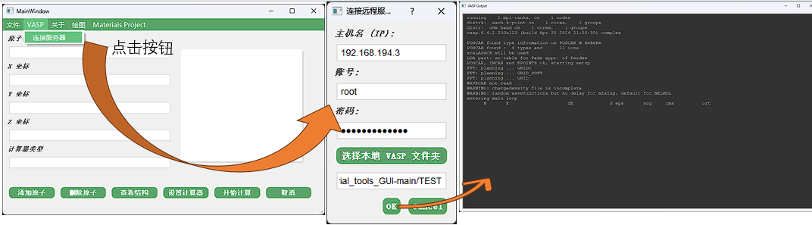

# Materials Science GUI Suite (材料科学计算 GUI 套件)
(Core source codes for the NJmat software project)

这是一个基于 Python 和 PyQt5 开发的材料科学图形用户界面套件。本项目包含两个核心工具，分别针对 **传统 DFT 计算流程 (VASP/ASE)** 和 **机器学习势能 (CHGNet)** 的应用场景。

## 📦 包含的工具

### 1. VASP/ASE Interface (VASP 远程管理工具)
基于 ASE (Atomic Simulation Environment) 开发，主要用于原子结构建模、VASP 远程任务提交与监控、以及能带结构可视化。

*   **核心功能**:
    *   **结构建模**: 手动添加原子、查看 3D 结构、导入 CIF 文件。
    *   **远程计算**: 通过 SSH 连接服务器，自动上传输入文件 (`INCAR`, `POSCAR` 等)，提交任务并实时回传日志。
    *   **数据可视化**: 读取 `EIGENVAL` 文件绘制能带结构图。
    *   **扩展功能**: 支持 CIF 下载与描述符设计（需额外模块）。

### 2. CHGNet GUI (机器学习势能工具)
基于 CHGNet (Crystal Hamiltonian Graph Neural Network) 开发，利用预训练的通用机器学习势能进行快速的材料模拟。

*   **核心功能**:
    *   **直接推理 (Direct Inference)**: 快速预测晶体结构的能量、受力、应力和磁矩。
    *   **结构优化 (Structure Optimization)**: 使用 CHGNet 对晶体结构进行弛豫（Relaxation），无需昂贵的 DFT 计算。
    *   **分子动力学 (Molecular Dynamics)**: 支持 NVT 等系综，自定义温度、步长和设备 (CPU/CUDA) 进行 MD 模拟。

---

## 🛠️ 安装与依赖

在运行本套件之前，请确保您的环境中安装了 Python 3.8+ 以及以下依赖库。

### 1. 基础依赖
```bash
pip install PyQt5 numpy matplotlib
```

### 2. VASP 工具依赖
```bash
pip install ase paramiko
```

### 3. CHGNet 工具依赖
```bash
pip install pymatgen chgnet torch
```
*(注意：CHGNet 依赖 PyTorch，建议根据您的 CUDA 版本去 PyTorch 官网安装对应的 GPU 版本以获得最佳性能)*

---

## 🚀 使用指南

### 工具一：VASP/ASE Interface

```bash
python MT-NUIST.py
```

**操作流程**:
1.  **建模**: 在左侧输入原子坐标或通过 `File` -> `Import cif` 导入结构。
2.  **连接服务器**: 点击菜单 `VASP` -> `Connect Server`，输入服务器 IP、账号密码，并选择包含 VASP 输入文件的**本地文件夹**。
3.  **运行**: 程序将自动上传文件并在远程目录 `VASP_calculation` 下执行计算，日志实时显示。
4.  **绘图**: 点击菜单 `Plot` -> `Band Structure`，选择计算生成的 `EIGENVAL` 文件进行绘图。



### 工具二：CHGNet GUI

```bash
python CHGnet_reload.py
```


**操作流程**:
1.  **加载文件**: 点击 "Load CIF file" 选择本地的晶体结构文件。
2.  **选择功能**: 在下拉菜单中选择：
    *   `Direct Inference`: 静态计算能量和力。
    *   `Molecular Dynamics`: 弹出参数设置窗口，设置温度、步数等参数后运行。
    *   `Structure Optimization`: 对结构进行几何优化。
3.  **运行**: 点击 "Run CHGnet"，结果将显示在下方的文本框中。

---

## ⚠️ 注意事项

1.  **VASP 环境**: 使用 VASP 工具时，远程服务器必须已安装 VASP，且 `vasp_std` 命令需在环境变量中可用。
2.  **CHGNet 模型**: 首次运行 CHGNet 工具时，程序会自动下载预训练模型（约几十 MB），请保持网络连接。
3.  **硬件加速**: CHGNet 推荐在 GPU (CUDA) 环境下运行。如果在 CPU 上运行 MD 模拟，速度可能会较慢。
4.  **文件覆盖**: VASP 工具在远程计算时会清空目标文件夹下的 `VASP_calculation` 目录，请谨慎操作。
5.  **附属模块**: VASP 工具代码中引用了 `CIFDownload` 和 `DescriptorDesign` 模块，如缺少这些文件，相关菜单功能将不可用，但不影响主流程。

---

## 👤 作者信息

*   **Author**: Albertdeng23
*   **Email**: issicdeng@outlook.com
*   **GitHub**: [https://github.com/Albertdeng23](https://github.com/Albertdeng23)

## 📄 许可证

本项目遵循开源协议，具体请参考 GitHub 仓库说明。